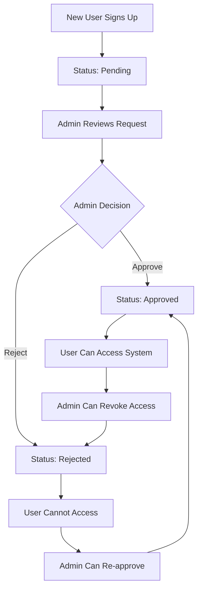

# FinanceFlow Pro - Complete Authentication System

A comprehensive billing and financial management application with admin approval workflow for new users.

## Features

### 🔐 Authentication System
- **Simple Registration**: New users request access with just email and password
- **Pre-configured Admin**: Admin account (`shourya758@gmail.com`) is automatically created
- **Admin Approval Workflow**: New users require admin approval before accessing the system  
- **Role-based Access**: Support for Admin, Manager, and User roles
- **Session Management**: Secure server-side sessions with automatic status checking
- **Real-time Status Updates**: Users are automatically logged in when approved

### 👥 User Management
- **Admin Dashboard**: Complete user management interface
- **Approval Workflow**: Approve or reject pending users
- **Role Management**: Change user roles (Admin, Manager, User)  
- **User Statistics**: View counts of pending, approved, and rejected users
- **User Activity**: Track registration and login dates

### 📊 Financial Management
- **Invoice Management**: Create, edit, and track invoices
- **Transaction Tracking**: Comprehensive transaction management
- **Dashboard Analytics**: Real-time financial insights
- **Report Generation**: Export data to Excel

## Installation & Setup

### Prerequisites
- Python 3.8 or higher
- Firebase project with Firestore enabled
- Firebase service account key

### 1. Install Dependencies

```bash
pip install -r requirements.txt
```

### 2. Firebase Setup

1. **Create a Firebase Project**:
   - Go to [Firebase Console](https://console.firebase.google.com/)
   - Create a new project or use existing one
   - Enable Firestore Database

2. **Get Service Account Key**:
   - Go to Project Settings → Service Accounts
   - Generate new private key
   - Save as `firebase-service-account.json` in the project root

3. **Update Firebase Config**:
   - Update the Firebase configuration in `index.html` (lines 17-25) with your project details

### 3. Admin Account

The admin account is automatically created when you start the application:

**Admin Setup (secure):**
- Set ADMIN_EMAIL and ADMIN_PASSWORD in your environment (or .env file)
- On start, the app will create the admin if it does not exist (controlled by INIT_ADMIN_ON_START)
- Do not commit .env or service account keys to Git

### 4. Start the Application

```bash
python app.py
```

The application will start on `http://localhost:5000`

### 5. Test the System (Optional)

Test the admin login and user signup functionality:

```bash
python test_admin.py
```

This will verify that:
- Admin can login with the configured credentials
- New users can request access
- The server is running properly

## Usage Guide

### For New Users

1. **Request Access**:
   - Click "Request Access" on the login page
   - Enter your email and password
   - Submit your access request and wait for admin approval

2. **After Approval**:
   - You'll be automatically logged in when approved
   - Or manually log in with your credentials

### For Admins

1. **Login as Admin**:
   - Use email: `shourya758@gmail.com`
   - Use password: `Shourya12@`

2. **Access Request Management**:
   - Navigate to the Admin section
   - View all pending access requests
   - See user statistics (pending, approved, rejected)
   - Approve or reject requests with one click

3. **User Management**:
   - Change user roles for approved users
   - Revoke access from existing users
   - Re-approve previously rejected users

## System Architecture

### Backend (Flask)
- **Authentication Routes**: `/api/auth/*`
  - `POST /api/auth/signup` - User registration  
  - `POST /api/auth/login` - User login
  - `POST /api/auth/logout` - User logout
  - `GET /api/auth/me` - Get current user

- **Admin Routes**: `/api/admin/*`
  - `GET /api/admin/users` - List all users
  - `PUT /api/admin/users/:id/approve` - Approve user
  - `PUT /api/admin/users/:id/reject` - Reject user  
  - `PUT /api/admin/users/:id/role` - Update user role

- **Protected Routes**: All existing API routes are now protected and require approved user status

### Frontend (JavaScript)
- **AuthManager Class**: Handles all authentication logic
- **Admin Panel**: Complete user management interface  
- **Status Checking**: Automatic polling for status changes
- **Session Handling**: Seamless login/logout experience

### Database Structure (Firestore)

#### Users Collection
```json
{
  "email": "string", 
  "password": "string (hashed)",
  "status": "pending|approved|rejected",
  "role": "Admin|Manager|User",
  "createdAt": "timestamp",
  "lastLogin": "timestamp|null"
}
```

## Security Features

- **Password Hashing**: SHA-256 hashing for passwords
- **Server-side Sessions**: Secure session management
- **CORS Configuration**: Proper cross-origin handling
- **Input Validation**: Comprehensive input sanitization
- **Role-based Authorization**: Endpoint protection by role

## User Workflow



## Configuration Options

### Environment Variables
Create a `.env` file (example below). Do not commit your real `.env` to Git.

```env
# Flask
SECRET_KEY=your-secret-key-here
FLASK_ENV=development
PORT=5000

# Admin bootstrap (optional, used to auto-create first admin)
INIT_ADMIN_ON_START=true
ADMIN_EMAIL=admin@example.com
ADMIN_PASSWORD=please-change

# Firebase credentials (choose ONE of the following)
# 1) JSON string (recommended for CI):
# FIREBASE_CREDENTIALS_JSON={"type":"service_account", ...}
# 2) Path to key file on disk:
# GOOGLE_APPLICATION_CREDENTIALS=C:\\path\\to\\firebase-service-account.json
# or fallback (defaults to firebase-service-account.json):
# FIREBASE_CREDENTIALS_FILE=firebase-service-account.json
```


## Troubleshooting

### Common Issues

1. **Firebase Connection Error**:
   - Check `firebase-service-account.json` exists
   - Verify Firebase project settings
   - Ensure Firestore is enabled

2. **No Admin User**:
   - Run `python create_admin.py` to create first admin
   - Check user status in Firestore console

3. **CORS Issues**:
   - Ensure `credentials: 'include'` in fetch requests
   - Check Flask-CORS configuration

4. **Session Issues**:
   - Clear browser cookies/localStorage
   - Restart Flask application
   - Check Flask-Session configuration

## Development Notes

### File Structure
```
├── app.py                 # Flask backend with auth routes
├── auth.js               # Authentication management  
├── admin.js              # Admin user management
├── script.js             # Main application logic
├── index.html            # Main application UI
├── create_admin.py       # Admin user creation script
├── requirements.txt      # Python dependencies
├── firebase-service-account.json  # Firebase credentials
└── README.md             # This file
```

### Extending the System

1. **Add New User Fields**: Update user schema in both backend and frontend
2. **Custom Approval Workflow**: Modify approval logic in `app.py`
3. **Email Notifications**: Add email sending on approval/rejection
4. **Advanced Permissions**: Implement granular permissions beyond roles

## Support

For issues or questions:
1. Check the troubleshooting section above
2. Review Firebase console for data issues  
3. Check browser console for JavaScript errors
4. Verify Flask application logs

---

**🚀 Your complete authentication system is now ready!**

New users can register and wait for approval, while admins can manage all users through the intuitive admin panel.
